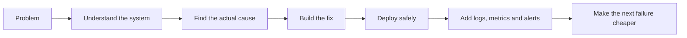

<div align="center">

# Dmitry · Dpsley

### Backend · LLMOps · AI Systems · Infrastructure

[](https://git.io/typing-svg)

[](https://github.com/Dpsley)
[](https://leetcode.com/Dpsley/)


</div>

---

## About me

I am Dmitry, an engineer who does not fit comfortably into one narrow title.

My main field is the intersection of **backend development, LLMOps, applied AI and infrastructure**. I like projects where it is not enough to write a handler and call it a day — the API, data, deployment, monitoring, integrations and failure modes all have to work together.

I build and maintain:

- production APIs and internal microservices;
- RAG systems, LLM agents, embeddings and model-serving pipelines;
- infrastructure, containers, Kubernetes environments and observability;
- corporate integrations, automation tools and data-processing services;
- systems that have to survive contact with real users, legacy software and Friday deployments.

I value direct communication, technical depth and practical results.  
A beautiful architecture that does not solve the problem is still useless — just more elegantly useless.

```text
Input:  "some shit is broken"
Output: root cause → fix → monitoring → fewer surprises next time
```

---

## Beyond work

I am not made entirely of YAML and stack traces.

- 🎣 I am into spinning fishing and like choosing gear with the same unnecessary thoroughness as infrastructure.
- 🎮 I enjoy survival and management games where one bad decision can ruin an entire settlement.
- ☕ Coffee is less of a beverage and more of a runtime dependency.
- 🔧 I like understanding how things work, repairing them and refusing to leave a problem as “probably fine”.
- 🧠 I am curious by default and can disappear into a technical rabbit hole until the rabbit has documentation and metrics.

---

## What I work on

<table>
<tr>
<td width="50%" valign="top">

### AI & LLMOps

- Retrieval-Augmented Generation
- LLM agents and tool calling
- Embeddings, reranking and vector search
- Multimodal retrieval
- Model serving with vLLM
- Evaluation and observability
- PyTorch and Hugging Face ecosystems

</td>
<td width="50%" valign="top">

### Backend & Integration

- Python and PHP services
- FastAPI, Flask and Laravel
- REST APIs and OpenAPI
- PostgreSQL and document databases
- Telegram bots and internal tools
- Bitrix, 1C and corporate integrations
- Async processing and automation

</td>
</tr>
<tr>
<td width="50%" valign="top">

### Infrastructure

- Linux administration
- Docker and Kubernetes / k3s
- Nginx and Apache
- CI/CD and deployment automation
- Networking and reverse proxies
- Security hardening and WAF
- Production troubleshooting

</td>
<td width="50%" valign="top">

### Observability

- Prometheus and exporters
- Grafana dashboards and alerting
- Loki log aggregation
- Tempo distributed tracing
- OpenTelemetry instrumentation
- Service health monitoring
- Performance and failure analysis

</td>
</tr>
</table>

---

## Core stack

### Languages & backend

<p>
  
</p>

### AI, ML & data

<p>
  
</p>

### Databases

<p>
  
</p>

### Infrastructure & tooling

<p>
  
</p>

### Frontend

<p>
  
</p>

<details>
<summary><strong>Extended technology list</strong></summary>
<br>


</details>

---

## Engineering mindset



My preferred workflow is simple:

1. Understand what is actually broken.
2. Separate symptoms from the root cause.
3. Fix the system, not only the visible error.
4. Make the result observable and maintainable.
5. Document enough so nobody has to perform digital archaeology later.

---

## GitHub analytics

<div align="center">


</div>

<div align="center">

[](https://github.com/Dpsley)

</div>

---

